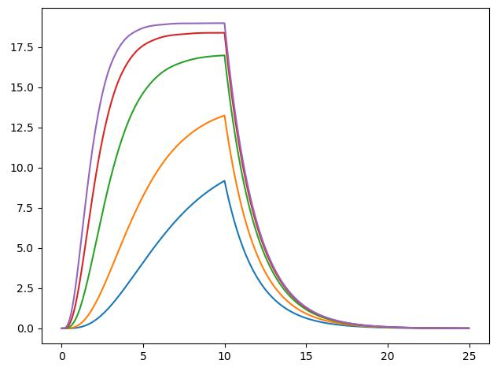

# Potassium DR channel (kdr)
Reproduced fig. 3.5 from Sterratt, Graham et al. Principles of Computational Modeling in Neuroscience

* Simulational K conductancy and open/close state with n^4 for 26, 38, 63, 88, 109 mV

* HH K open/close state from the book

* HH K conductancy from the book for 26, 38, 63, 88, 109 mV

* Simulational K open/close dynamics with alpha and beta params:

* Open/close Book dynamics for alpha and beta params:

* Simulational Na conductancy with m^3 * h for -40, -30, -20, 20, 40 mV:

* HH Na conductancy from the book:

