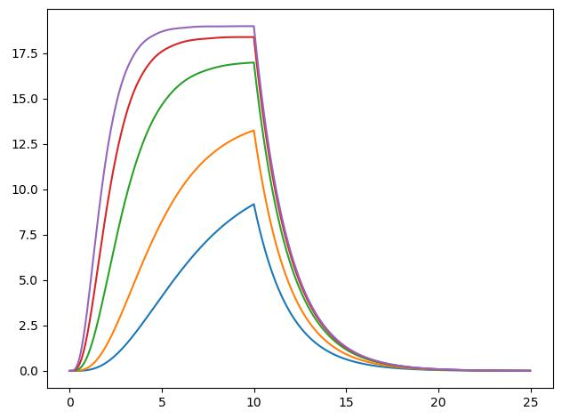

# Potassium DR channel (kdr)
Reproduced fig. 3.5 from Sterratt, Graham et al. Principles of Computational Modeling in Neuroscience

Simulational conductancy and open/close state for 26, 38, 63, 88, 109 mV

HH conductancy from the book for 26, 38, 63, 88, 109 mV

HH open/close state from the book

