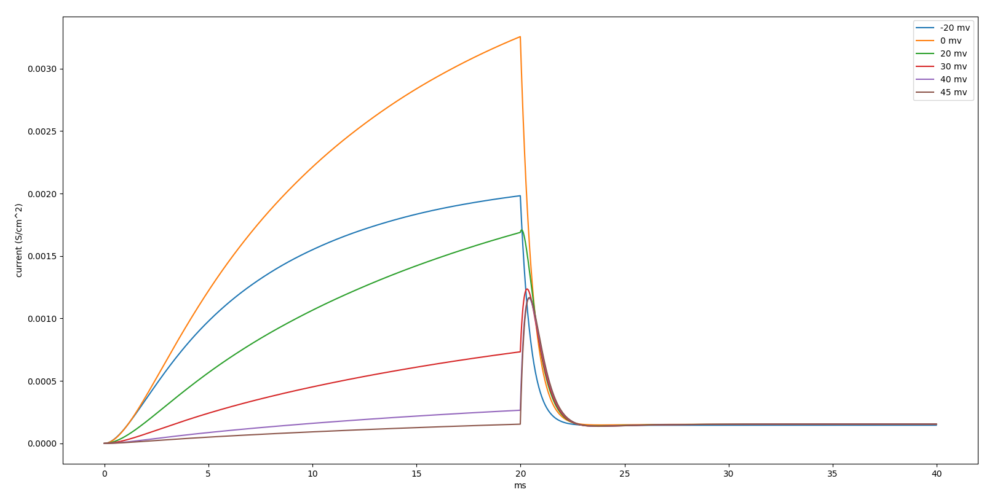
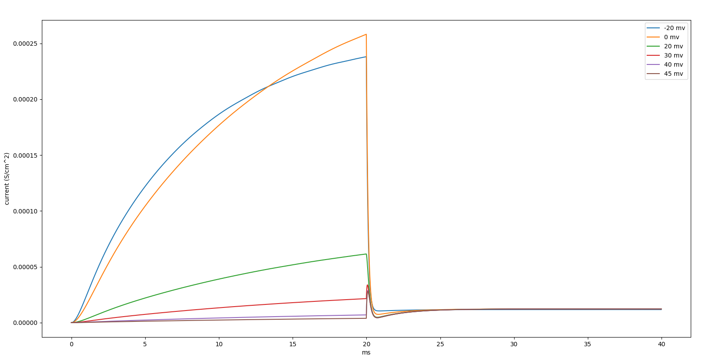
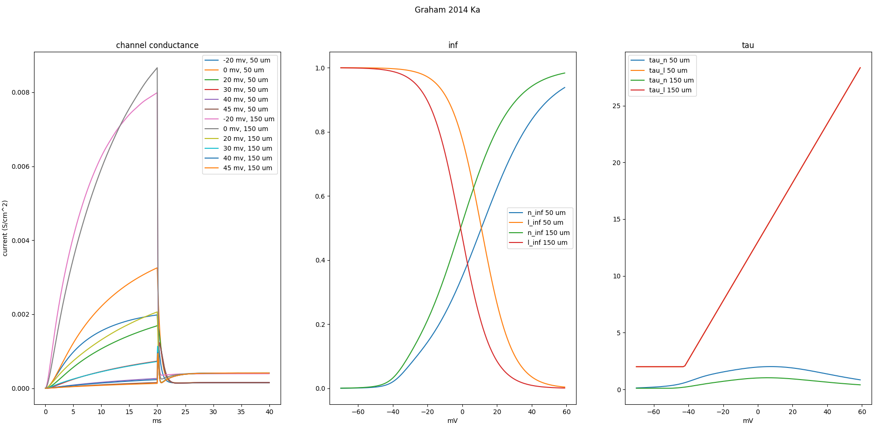
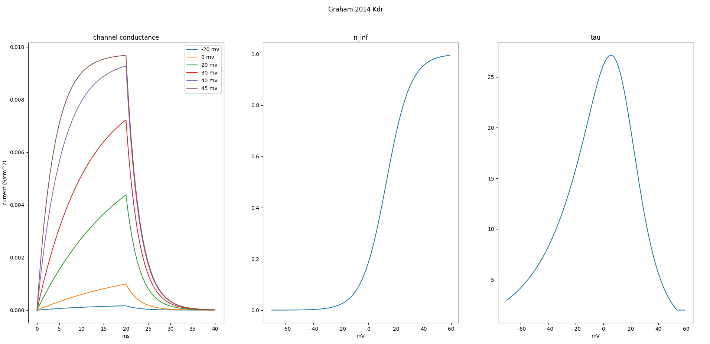
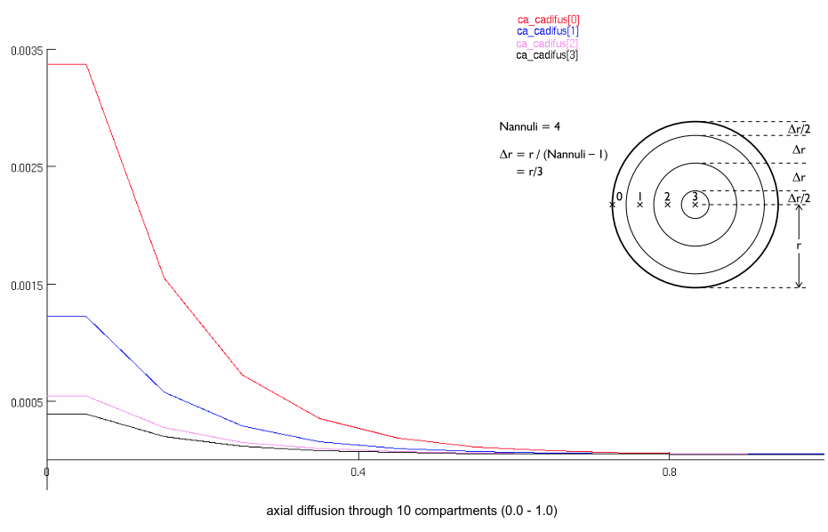

# Potassium DR channel (kdr)

* Graham 2014 Ka conductance for channel located on 50 um from soma:

* Graham 2014 Ka conductance for channel located on 350 um from soma:

* Graham 2014 Kdr conductance:

* Graham 2014 Ka full characteristics:

* Graham 2014 Kdr full characteristics:

* HH K conductance

* HH K open/close state from the book

* HH K conductance from the book for 26, 38, 63, 88, 109 mV

* Simulational K open/close dynamics with alpha and beta params:

* Open/close Book dynamics for alpha and beta params:

* HH Na conductance

* HH Na conductancy from the book:

* Ca2+ diffusion (NEURON):
  * injection of 0.01 mM Ca2+ to the outermost shell compartment 0.0
  * simulation for 0.02 ms
  

Book photosa from Sterratt, Graham et al. Principles of Computational Modeling in Neuroscience

