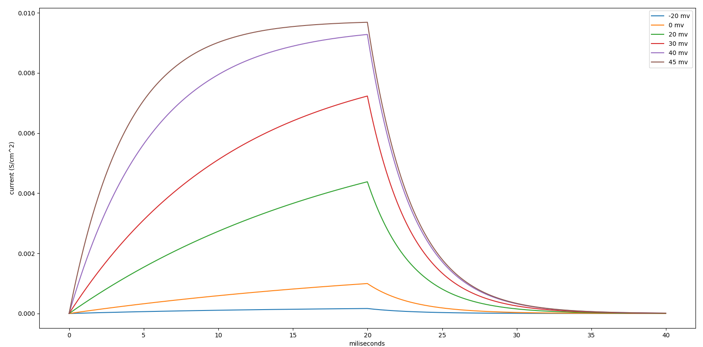
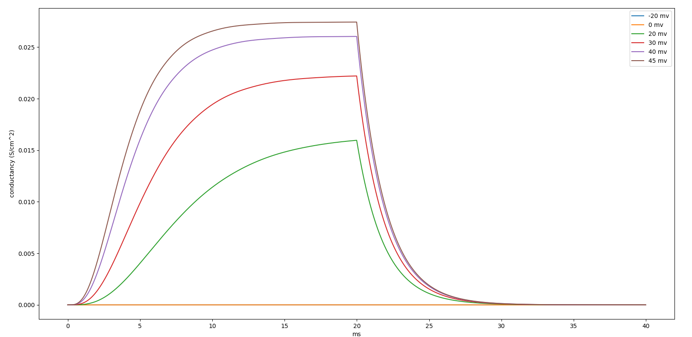
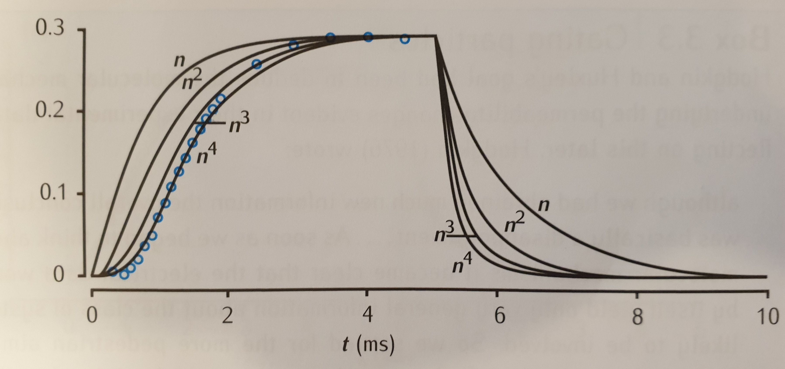
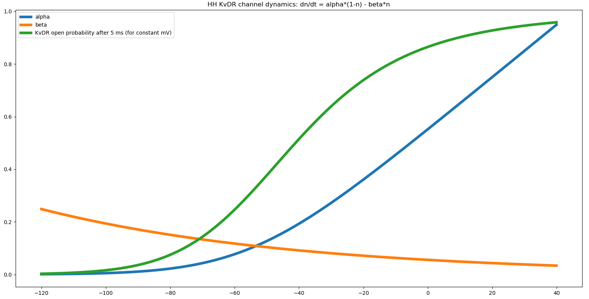
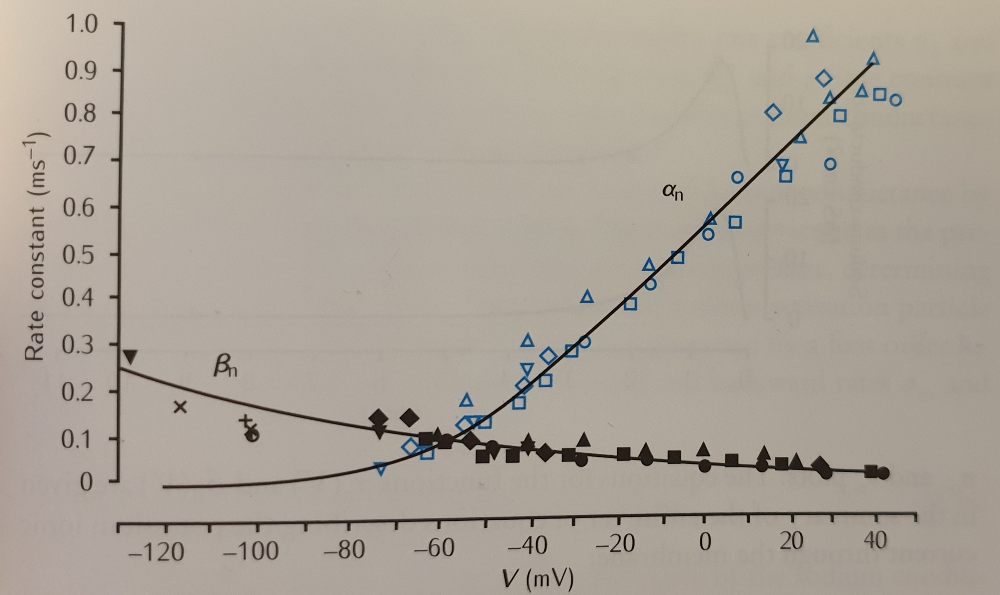
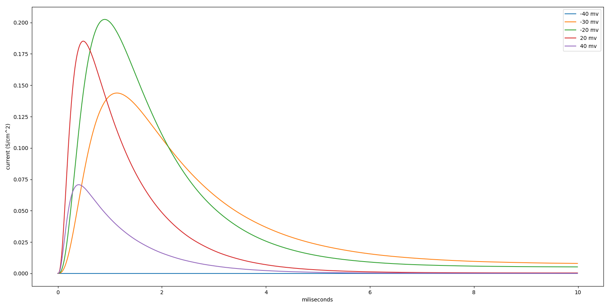
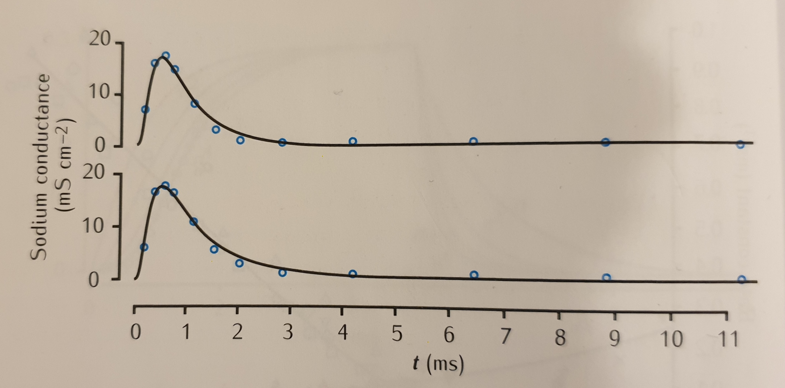

# Potassium DR channel (kdr)
Reproduced fig. 3.5 from Sterratt, Graham et al. Principles of Computational Modeling in Neuroscience

* Graham 2014 Kdr conductance:

* HH K conductance

* HH K open/close state from the book

* HH K conductance from the book for 26, 38, 63, 88, 109 mV

* Simulational K open/close dynamics with alpha and beta params:

* Open/close Book dynamics for alpha and beta params:

* HH Na conductance

* HH Na conductancy from the book:

