# To recreate
* Channels: run Python files without arguments
* Ca2+ diffusion: with NEURON:
```
cd diffusion
nrnivmodl
nrngui cadif.hoc
```

# Potassium DR channel (kdr)

* Graham 2014 Ka conductance for channel located on 50 um from soma:


* Graham 2014 Ka conductance for channel located on 350 um from soma:
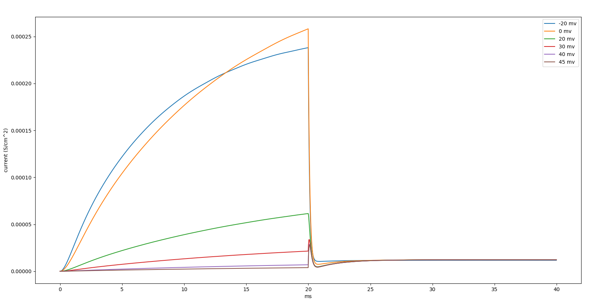

* Graham 2014 Kdr conductance:
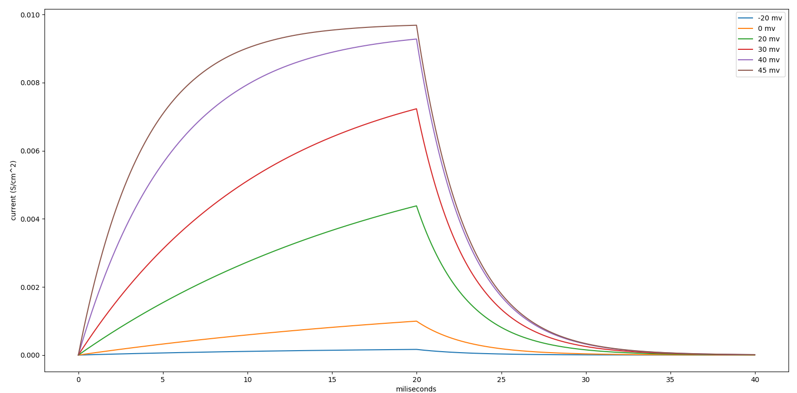

* Graham 2014 Ka full characteristics:
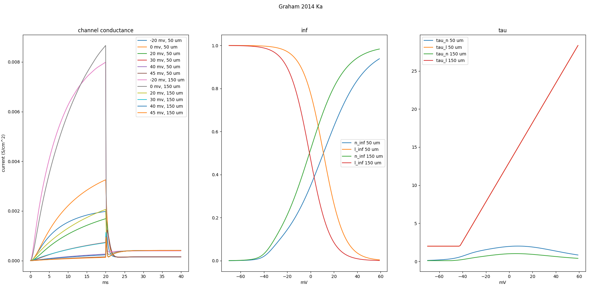

* Graham 2014 Kdr full characteristics:
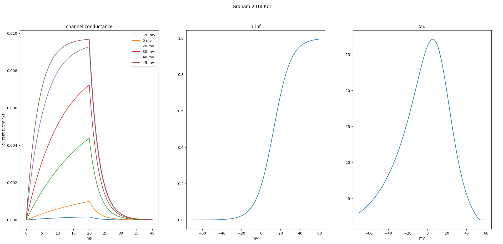

* HH K conductance
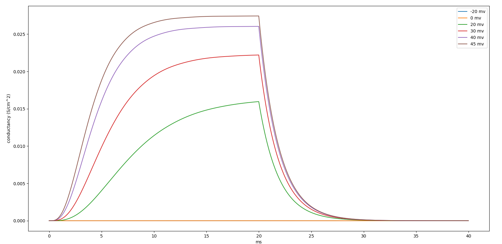

* HH K open/close state from the book
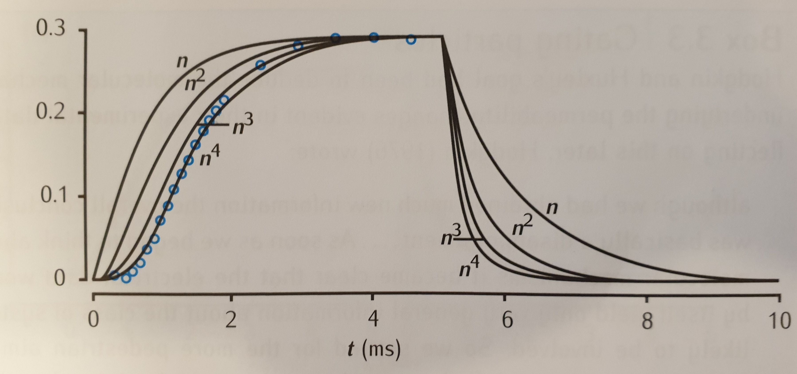

* HH K conductance from the book for 26, 38, 63, 88, 109 mV
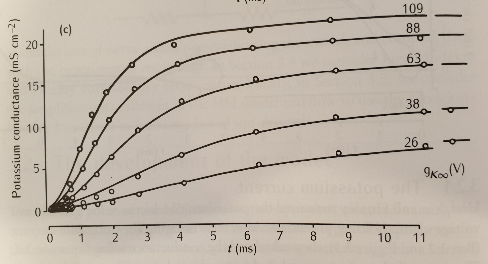

* Simulational K open/close dynamics with alpha and beta params:
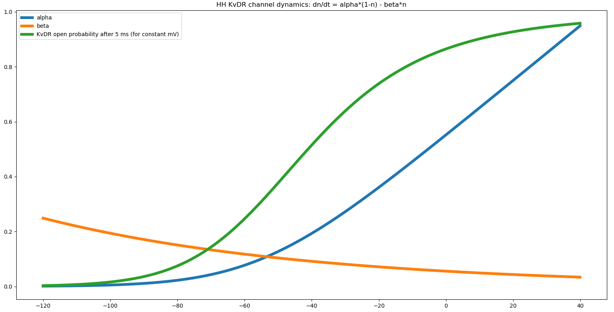

* Open/close Book dynamics for alpha and beta params:
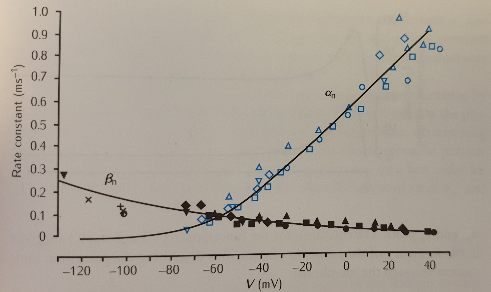

* HH Na conductance
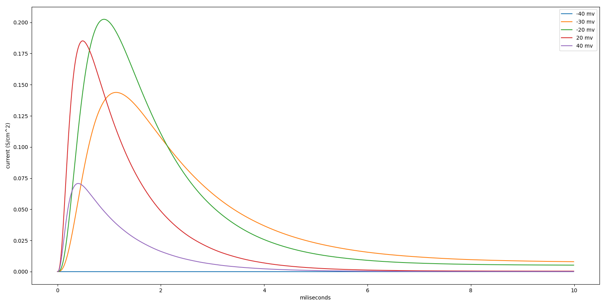

* HH Na conductancy from the book:
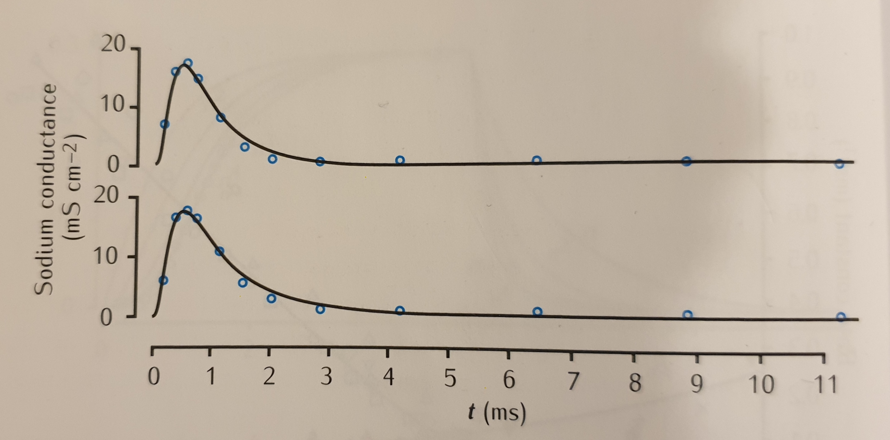

* Ca2+ dendritic diffusion (NEURON):
  * injection of 0.01 mM Ca2+ to the outermost shell compartment 0.0
  * simulation for 0.02 ms
  
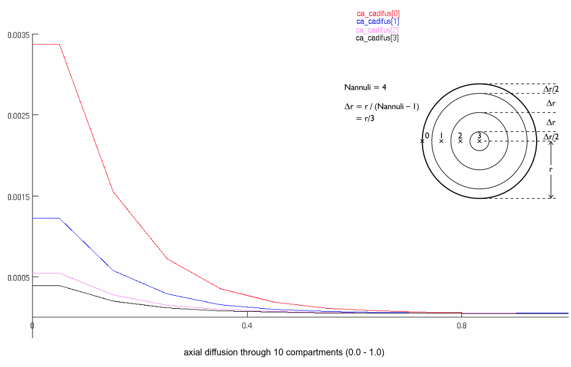

* Ca2+ radial diffusion schema - spine_head->spine_neck->dendrite:

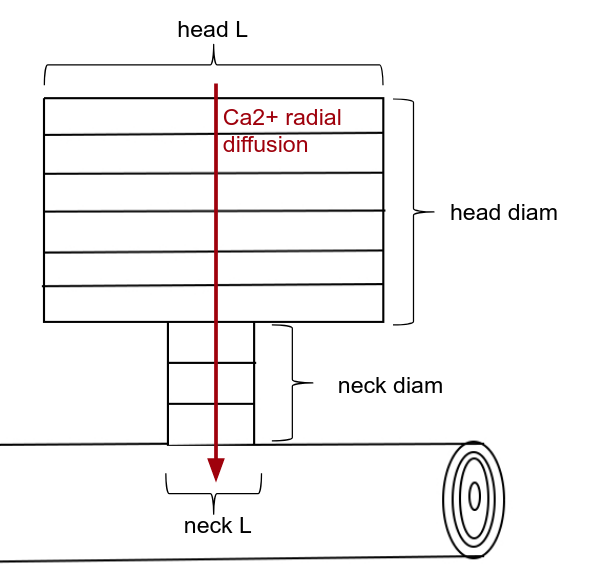

* Ca2+ for only dendritic spine head radial diffusion (NEURON):
  * injection of 0.01 mM Ca2+ to the 0.5 location on the head
  * simulation for 0.16 ms
  
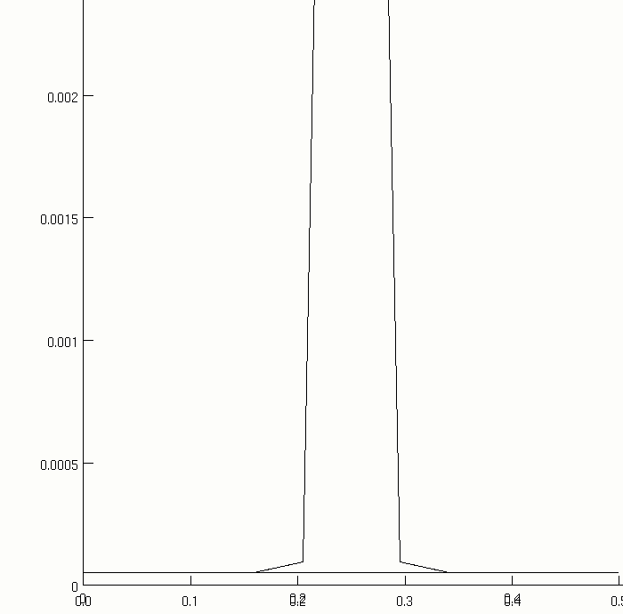

* Ca2+ diffusion comparision of MOD-based shell diffusion vs RxD diffusion:

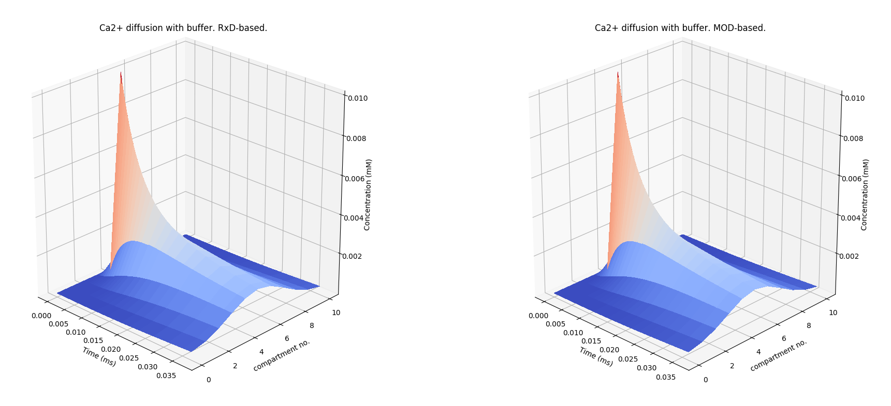

Book model of dendritic shells: Nicholas T. Carnevale, Michael L. Hines, The NEURON Book, 2006

Book photos of charts from: Sterratt, Graham et al. Principles of Computational Modeling in Neuroscience, 2011

